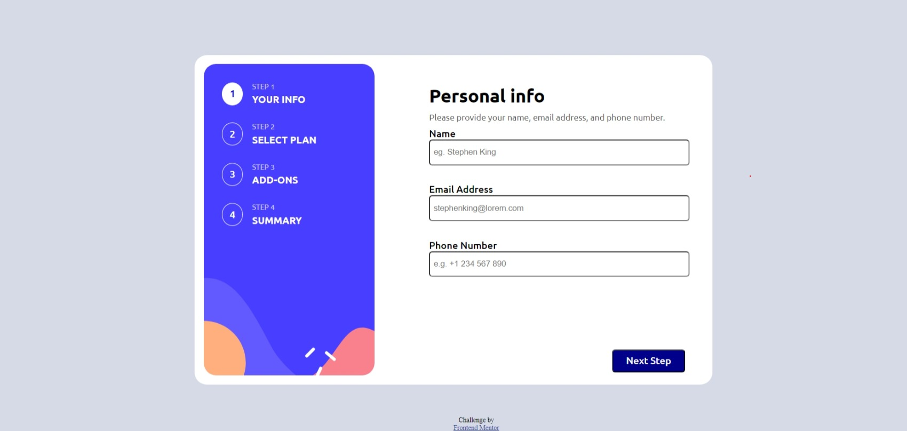

# Frontend Mentor - Multi-step form solution

This is a solution to the [Multi-step form challenge on Frontend Mentor](https://www.frontendmentor.io/challenges/multistep-form-YVAnSdqQBJ). Frontend Mentor challenges help you improve your coding skills by building realistic projects. 

## Table of contents

- [Overview](#overview)
  - [The challenge](#the-challenge)
  - [Screenshot](#screenshot)
  - [Links](#links)
- [My process](#my-process)
  - [Built with](#built-with)
  - [What I learned](#what-i-learned)
  - [Useful resources](#useful-resources)
- [Author](#author)

**Note: Delete this note and update the table of contents based on what sections you keep.**

## Overview

### The challenge

Users should be able to:

- Complete each step of the sequence
- Go back to a previous step to update their selections
- See a summary of their selections on the final step and confirm their order
- View the optimal layout for the interface depending on their device's screen size
- See hover and focus states for all interactive elements on the page
- Receive form validation messages if:
  - A field has been missed
  - The email address is not formatted correctly
  - A step is submitted, but no selection has been made

### Screenshot

### Links

- [Solution URL](https://your-solution-url.com)
- [Live site URL](https://your-live-site-url.com)

## My process

### Built with

- Semantic HTML5 markup
- CSS custom properties
- Flexbox
- CSS Grid
- Javascript

### What I learned

- How to write CSS code for both mobile size and desktop size.

- How to create a custom checkbox.

- How to create a toggle bar.

- How various categories of 'display' attribute work.

- How to add eventListeners and how are they useful.

### Useful resources

- [W3 Schools](https://www.w3schools.com) - This helped me in learning how various HTML tags work and how to use them correctly.

- [Stack overflow](https://www.stackoverflow.com) - This helped me a lot when i was stuck during the styling part.

## Author

- Frontend Mentor - [@anirudh1970](https://www.frontendmentor.io/profile/@anirudh1970)
